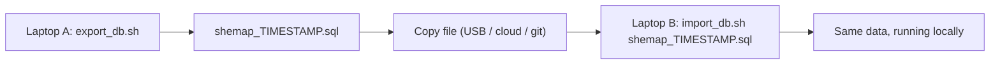

# SheMap database backups

Your data lives in a **local** PostgreSQL database (`shemap` on `localhost:5432`),
so it only exists on the machine where Postgres is installed. To move your data
to another laptop, take a snapshot with the scripts below.

This folder holds the exported `.sql` dump files.

## Move your data to another laptop



### 1. Export (on the laptop that currently has your data)

```bash
cd "Shemap v1/backend"
bash scripts/export_db.sh
```

This writes a file like `backups/shemap_20260626_143000.sql` and prints the row
counts it captured (users, contacts, reports, etc.).

### 2. Copy the file

Move the generated `.sql` file to the other laptop by any means (USB drive,
Google Drive, AirDrop, git, etc.).

### 3. Import (on the other laptop)

```bash
cd "Shemap v1/backend"
bash scripts/import_db.sh backups/shemap_20260626_143000.sql
```

This creates the `shemap` database if it's missing, then restores everything.

## Requirements on the other laptop

- PostgreSQL installed (ideally v15+ to match), e.g. `brew install postgresql@15`
  and `brew services start postgresql@15`.
- A `postgres` role whose password matches the one in `backend/.env`
  (`DATABASE_URL=...postgres:postgres123@...`). If the password differs, edit
  `backend/.env` on that laptop to match its local Postgres.

## Notes

- The dump is a **full snapshot** (schema + data) and includes the seeded demo
  reports, so the other machine ends up identical.
- It's a manual snapshot, not live sync — re-run `export_db.sh` whenever you want
  a fresh copy.
- These dumps can contain real personal data (contacts, reports). Don't commit
  them to a public repo.
